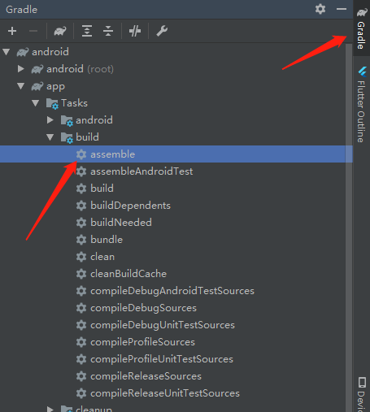
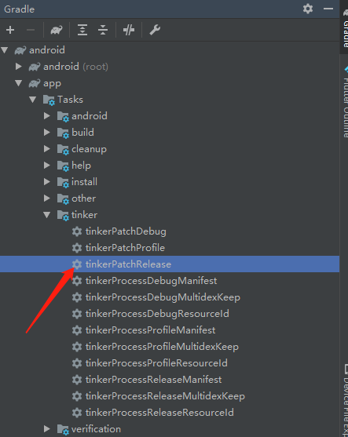
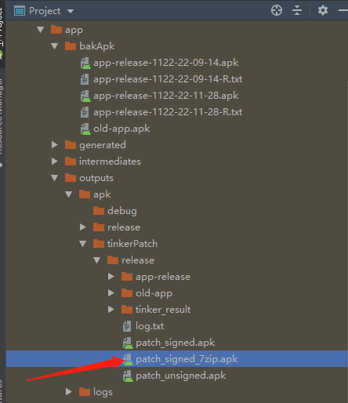

# flutter_local_hotfix

### flutter 集成 tinker 实现热修复 

步骤：

#### 1、执行 assemble 或者 assembleRelease 打一个 release 包

运行之后，会打包出 apk 出来，在 flutter 项目里面的 build/app 下

#### 2、找到 release 包，安装到手机

#### 3、修改 flutter 端代码或者原生端代码

#### 4、执行 tinkerPatchRelease  打差分包

将刚才打包好的 apk ，重命名为 old-app.apk 复制到 bakApk 目录中，

然后执行 tinkerPatchRelease 打差分包

#### 5、将差分包文件复制到手机根目录下

#### 6、运行查看效果

